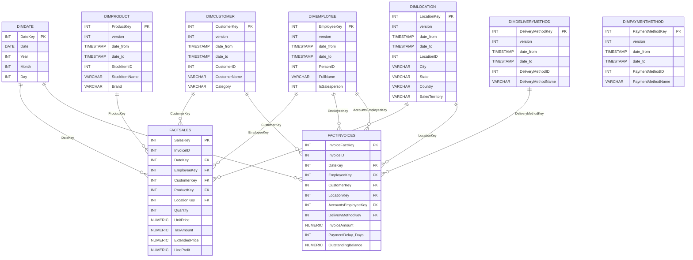

# Data Mart Implementation (P01)

**DECISION SUPPORT SYSTEMS, 2025-26**

**Team ###:** First name (number), First name (number), First name (number)

**Date:** 2026-05-05

---

## Introduction

The goal of this project is to design and implement a **data mart** based on the operational database of *Wide World Importers* (WWI), a fictitious wholesale novelty-goods importer headquartered in San Francisco, US. WWI's customers are mostly companies who resell to individuals — specialty stores, supermarkets, computing stores, tourist-attraction shops — across the United States.

The OLTP source covers WWI's full sales workflow: customers place **orders**, those orders are converted into **invoices** (with **invoice lines** at item granularity), items are physically moved through one of several **delivery methods**, and customers settle invoices via **customer transactions** linked to **payment methods**. When stock runs out, items are **backordered** and shipped later in a separate shipment. This work focuses on the *post-order* portion of the workflow — invoicing, fulfilment and the goods sold — so the data mart can answer questions such as *"Which products topped sales last month?"*, *"Which sales territories grew the most?"* or *"How does invoice volume vary by delivery method and salesperson?"*.

The deliverables include: (i) the dimensional model (Data Warehouse matrix, ER diagram, data description maps), (ii) the implementation of the **ELT process under the medallion architecture** (Bronze → Silver → Gold) on a Postgres target, and (iii) automated **data-quality checks** that validate the loaded mart.

---

## Data sources

The operational source is the **WWI sample database**, hosted on PostgreSQL at `postgres2.ipca.pt` (database `wwi`). The relational model is the *adapted* WWI ER diagram presented in the project guide: it covers `customers`, `customercategories`, `buyinggroups`, `people` (employees and contacts), `cities` / `stateprovinces` / `countries` (geography), `stockitems` / `stockgroups` / `colors` / `packagetypes` (catalog), `orders` / `orderlines` (orders), `invoices` / `invoicelines` (billing), `customertransactions` / `paymentmethods` / `transactiontypes` (financial events) and `deliverymethods` (logistics).

Data profiling was performed against the live source with `scripts/data_profiling.py` (VPN ON) and re-validated against the offline snapshots stored in `tmp_snapshots/`. The relevant business objects and their volumes are summarized below.

### Table 1: Summary of WWI database contents

| Event / object | Table | Nr. records | Nr. columns | PK | PK uniqueness |
|---|---|---:|---:|---|---:|
| Buying groups | `buyinggroups` | 2 | 2 | `buyinggroupid` | 100.00% |
| Cities | `cities` | 37,940 | 5 | `cityid` | 100.00% |
| Colors | `colors` | 36 | 2 | `colorid` | 100.00% |
| Countries | `countries` | 190 | 8 | `countryid` | 100.00% |
| Customer categories | `customercategories` | 8 | 2 | `customercategoryid` | 100.00% |
| Customers | `customers` | 663 | 28 | `customerid` | 100.00% |
| Customer transactions | `customertransactions` | 97,147 | 12 | `customertransactionid` | 100.00% |
| Delivery methods | `deliverymethods` | 10 | 2 | `deliverymethodid` | 100.00% |
| Invoice lines | `invoicelines` | 228,265 | 11 | `invoicelineid` | 100.00% |
| Customer invoices | `invoices` | 70,510 | 23 | `invoiceid` | 100.00% |
| Order lines | `orderlines` | 231,412 | 9 | `orderlineid` | 100.00% |
| Customer orders | `orders` | 73,595 | 14 | `orderid` | 100.00% |
| Package types | `packagetypes` | 14 | 2 | `packagetypeid` | 100.00% |
| Payment methods | `paymentmethods` | 4 | 2 | `paymentmethodid` | 100.00% |
| Employees and contacts | `people` | 1,111 | 18 | `personid` | 100.00% |
| Special deals | `specialdeals` | 2 | 12 | `specialdealid` | 100.00% |
| State provinces | `stateprovinces` | 53 | 6 | `stateprovinceid` | 100.00% |
| Stock groups | `stockgroups` | 10 | 2 | `stockgroupid` | 100.00% |
| Products / stock items | `stockitems` | 227 | 22 | `stockitemid` | 100.00% |
| Transaction types | `transactiontypes` | 13 | 2 | `transactiontypeid` | 100.00% |

**Profiling findings (relevant to the mart):**

- All primary keys present 100% uniqueness, so business keys can be reused as join columns into the dimensional layer.
- `paymentmethodid` lives on `customertransactions` (not on `invoices`), so payment information is collected from the transactions side, not directly from invoice headers. This influences how `DimPaymentMethod` participates in the mart.
- The `countries` snapshot exhibits a column-name typo (`ountryname`); this is corrected during the silver transform.
- `invoicelines` (228,265 rows) and `invoices` (70,510 rows) are the highest-volume operational events, so they drive the grain of the two fact tables.

---

## Dimensional modelling

### Goals and analytical questions

The data mart was designed to support a self-service analytic layer answering questions such as:

1. Which **stock items** generated the highest revenue last month / quarter / year?
2. Which **customer categories** or **sales territories** show the largest sales growth?
3. Which **salespersons** are top performers (by invoice volume and by line value)?
4. How does the choice of **delivery method** affect invoice value and on-time fulfilment?
5. What is the **invoice amount** distributed by **customer**, **date**, **location** and **delivery method**?
6. What is the breakdown of **payments** by **payment method** and **transaction type** (auxiliary, served from `customertransactions`)?

These questions translate to two confirmed business processes — **Sales** (line-level) and **Invoicing** (header-level) — sharing conformed dimensions for time, customer, employee and location.

### Table 2: Data Warehouse Matrix

| **DIMENSIONS →** | **DimDate** | **DimCustomer** | **DimEmployee** | **DimProduct** | **DimLocation** | **DimDeliveryMethod** | **DimPaymentMethod** |
|---|:---:|:---:|:---:|:---:|:---:|:---:|:---:|
| **Sales (FactSales)** — invoice line | X | X | X | X | X |  |  |
| **Invoicing (FactInvoices)** — invoice header | X | X | X |  | X | X |  |
| *(auxiliary)* Payments — `customertransactions` | X | X |  |  |  |  | X |

> The two primary fact tables loaded into Gold are `FactSales` and `FactInvoices`. The third row (Payments) is currently materialized at the silver level via `silver.stg_*` for completeness; it can be promoted to Gold as `FactPayments` if the analytical scope is later widened.

---

## Design of the dimensional data model

### Fact tables — granularity and measures

**FactSales** — *grain: one row per invoice line* (= one row per `invoicelines.invoicelineid`).

| Measure | Type | Derivation |
|---|---|---|
| `Quantity` | Additive | Direct from `invoicelines.quantity` |
| `UnitPrice` | Non-additive (avg) | Direct from `invoicelines.unitprice` |
| `TaxAmount` | Additive | Direct from `invoicelines.taxamount` |
| `ExtendedPrice` | Additive | Direct from `invoicelines.extendedprice` (already computed in source as `quantity × unitprice + tax`) |
| `LineProfit` | Additive | Direct from `invoicelines.lineprofit` |

**FactInvoices** — *grain: one row per invoice header* (= one row per `invoices.invoiceid`).

| Measure | Type | Derivation |
|---|---|---|
| `InvoiceAmount` | Additive | `SUM(invoicelines.extendedprice)` over the invoice |
| `PaymentDelay_Days` | Semi-additive | `MIN(customertransactions.transactiondate) − invoices.invoicedate` (days) |
| `OutstandingBalance` | Semi-additive | `InvoiceAmount − SUM(customertransactions.transactionamount)` for that invoice |

`PaymentDelay_Days` and `OutstandingBalance` are **derived measures** computed during the silver-to-gold step by joining `customertransactions` against `invoices`. They are documented as semi-additive because they only aggregate meaningfully across customers / dates, not over time-snapshot.

### Dimensions

| Dimension | SCD type | Justification |
|---|---|---|
| `DimDate` | Static (Type 0) | Calendar dimension generated programmatically; no history needed. |
| `DimCustomer` | **Type 2** | Customers can change category, name, etc.; history matters for trend analysis. |
| `DimEmployee` | **Type 2** | Salesperson role and full name change over time. |
| `DimProduct` | **Type 2** | Stock items can be renamed / rebranded. |
| `DimLocation` | **Type 2** | Composite of `cities` × `stateprovinces` × `countries`; rarely changes but treated as Type 2 for consistency. |
| `DimDeliveryMethod` | Type 2 (small) | Track renames; only 10 rows. |
| `DimPaymentMethod` | Type 2 (small) | Track renames; only 4 rows. |

The choice of **surrogate keys** (auto-incrementing `SERIAL`) decouples the dimensional model from the OLTP business keys and enables Type 2 history (multiple rows per business key, controlled by `version` / `date_from` / `date_to`).

### ER Diagram (star schema)



Data description maps for the two reference dimensions (DimCustomer and DimProduct) are presented in **Appendix A**.

---

## Data mart implementation

The pipeline follows the **medallion architecture** (Bronze → Silver → Gold) on a Postgres DWH (Supabase). Source extraction (over VPN, against `postgres2.ipca.pt`) and DWH loading (off VPN) are split across separate notebook cells so the operator toggles VPN exactly once.

### Architecture

```
public.* (WWI source — VPN ON)
        │  save → CSV + schema JSON in tmp_snapshots/, tmp_increments/
        ▼
bronze.* (full-fidelity copy — VPN OFF)
        │  read active snapshot, clean, conform
        ▼
silver.stg_* (staging, project-only columns — VPN OFF)
        │  SCD Type 2 for dims, surrogate-key lookups for facts
        ▼
gold.* (star schema — VPN OFF)
```

### Notebooks and transformations

| Notebook | Layer | Responsibility |
|---|---|---|
| `00_setup.ipynb` | meta | Loads `.env`, builds engines, creates `bronze`, `silver`, `gold` schemas, deploys `bronze._load_control` and the gold DDL. |
| `01_bronze.ipynb` | bronze | Two-phase pattern. **Extract (VPN ON):** dumps each source table to `tmp_snapshots/<table>.csv` with a paired schema JSON in `tmp_snapshots/_schema/`. Incremental snapshots for `invoices` / `invoicelines` are stored in `tmp_increments/`. **Apply (VPN OFF):** rebuilds bronze tables from the schema JSON, loads CSVs and registers each load (`status`, `rows_total`, `rows_inserted`, `rows_updated`) into `bronze._load_control`. |
| `02_silver.ipynb` | silver | DROP+CREATE staging tables, applies `clean_str` to free-text fields, fixes the `ountryname → country` typo, joins `customercategories` for customer category, joins `cities × stateprovinces × countries` to compose location, computes derived measures for `stg_fact_invoices`. |
| `03_gold.ipynb` | gold | Generates `DimDate` snapshot, calls `load_scd2()` per dimension (uses `row_hash()` over the SCD2-relevant columns to detect changes), then loads `FactSales` and `FactInvoices` by surrogate-key lookup against the *current* dim row (`date_to IS NULL`). Indexes and partial-unique constraints are applied from `scripts/create_indexes_and_constraints.sql`. |

### Key ELT functions

- `make_engine()` — factory returning the right SQLAlchemy engine for source vs DWH.
- `register_load()` — writes one row to `bronze._load_control` per applied snapshot/increment, with timestamp, row counts, status.
- `compute_row_hash()` / `row_hash()` — canonicalize values and hash with MD5 over `|`-joined SCD2 attributes.
- `load_scd2()` — closes the previous current row (`date_to = run_at`) and inserts the new version (`version + 1`) when a hash change is detected; otherwise no-ops.

### Quality checks (`04_quality_checks.py`)

For every load, the script writes `quality_report.json` and exits non-zero if any check fails:

- **Orphan FKs** in both fact tables.
- **Unmapped FKs** — silver business keys that found no current dim row (silent data-loss detection).
- **Duplicate current dim rows** (must be 0 thanks to partial-unique indexes).
- **Null percentages** on business keys vs `THRESHOLD_NULL_PERCENT = 5.0`.
- **Row-count reconciliation** between `silver.stg_*` and `gold.dim* (current)`.

### Data mart content — summary of loaded rows

Run on **2026-05-05**, captured from `quality_report.json` and `99_verification.py`.

| Gold table | Current rows | Notes |
|---|---:|---|
| `gold.DimDate` | (calendar-driven) | Snapshot dimension covering the invoice/transaction date range. |
| `gold.DimEmployee` | 1,111 | SCD2; `silver.stg_employees` → `gold.dimemployee` reconciled 1,111 ↔ 1,111. |
| `gold.DimCustomer` | 663 | SCD2; reconciled 663 ↔ 663. |
| `gold.DimProduct` | 227 | SCD2; reconciled 227 ↔ 227. |
| `gold.DimLocation` | 37,940 | SCD2; composite of city × state × country, reconciled 37,940 ↔ 37,940. |
| `gold.DimDeliveryMethod` | 10 | Reconciled 10 ↔ 10. |
| `gold.DimPaymentMethod` | 4 | Reconciled 4 ↔ 4. |
| `gold.FactSales` | 228,265 | Grain = invoice line, derived from `invoicelines`. |
| `gold.FactInvoices` | 70,510 | Grain = invoice header, derived from `invoices`. |

**Quality verdict:** all orphan-FK counts = 0, all unmapped-FK counts = 0, no duplicate current rows, and 0% nulls on every business key. The mart is internally consistent.

---

## Conclusion

**Strengths.**

- The medallion architecture is implemented end-to-end (Bronze → Silver → Gold) with clean separation between source extraction and DWH loading, addressing the operational VPN constraint without manual intervention.
- All seven dimensions and both fact tables follow textbook Kimball patterns: SERIAL surrogate keys, SCD Type 2 with `version` / `date_from` / `date_to`, partial-unique indexes guarding the *current* row, and FK lookups in the fact load.
- The pipeline is **idempotent**: silver staging tables are DROP+CREATE on every run, gold dimensions are merged via SCD2 hashing, and `bronze._load_control` records every apply for full traceability.
- Automated quality checks (`04_quality_checks.py` + `99_verification.py`) close the loop: a failing FK or duplicate dim row breaks the build, not the report.

**Weaknesses / known limitations.**

- `DimDate` is loaded as a snapshot covering only the observed invoice date range; a fully-attributed calendar (fiscal year, holidays, weekday names) would broaden time-based analysis.
- Payments are currently exposed only via `silver.stg_fact_invoices` and the auxiliary `customertransactions` mapping; a dedicated `FactPayments` would make payment-method analytics first-class.
- Source-side schema typos (`ountryname`) are silently fixed in silver but are not pushed back as a data-quality issue to the source owners.
- `OrderLines` and the fulfilment side (backorders) are not modelled; the mart focuses on invoiced sales only.

**Future work.**

- Promote `silver.stg_fact_invoices` payment join into a Gold `FactPayments` table.
- Extend `DimDate` with a generated 2010–2030 range and standard fiscal/holiday attributes.
- Add aggregate/cumulative tables (`agg_sales_monthly`, `agg_sales_by_territory`) for dashboard latency.
- Wire the quality report into a CI step so an `ERROR` row in `bronze._load_control` blocks downstream layers automatically.

---

## Bibliography

- Kimball, R., & Ross, M. (2013). *The Data Warehouse Toolkit: The Definitive Guide to Dimensional Modeling* (3rd ed.). Wiley.
- Microsoft. (n.d.). *Wide World Importers sample database overview*. Retrieved from https://docs.microsoft.com/en-us/sql/samples/wide-world-importers-what-is?view=sql-server-ver15
- Inmon, W. H. (2005). *Building the Data Warehouse* (4th ed.). Wiley.
- Databricks. (2023). *What is the medallion lakehouse architecture?* Retrieved from https://www.databricks.com/glossary/medallion-architecture
- The PostgreSQL Global Development Group. (2024). *PostgreSQL 16 Documentation*. Retrieved from https://www.postgresql.org/docs/16/

---

## Appendix A — Data description maps

This appendix documents the column-level mapping between the source (OLTP) and the data mart (Gold) for the two reference dimensions, **DimCustomer** and **DimProduct**.

### Table 3: Data description map of DimCustomer

| Name | Type of table | Nr. records | Description |
|---|---|---:|---|
| `DimCustomer` | Dimension | 663 (current rows) | Customers of WWI, with category resolved from `customercategories`. SCD Type 2: historical changes are preserved via `version` / `date_from` / `date_to`. |

| Target (Data mart) ||||  Source (OLTP) ||| ETL rules | Example of values |
|---|---|---|---|---|---|---|---|---|
| **Column** | **Description** | **Data type** | **SCD** | **Table** | **Column** | **Data type** | | |
| `CustomerKey` | Surrogate key | INT (SERIAL) | 1 | — | — | — | Auto-generated by Postgres `SERIAL` on insert. Excluded from the `to_sql` payload. | 1, 2, 3, … |
| `CustomerID` | Business key (natural) | INT | 1 | `customers` | `customerid` | int4 | Direct copy. | 832 |
| `CustomerName` | Customer name | VARCHAR(255) | 2 | `customers` | `customername` | varchar | `clean_str` (trim, empty → NULL). | "Alvin Bollinger" |
| `Category` | Customer category | VARCHAR(255) | 2 | `customercategories` | `customercategoryname` | varchar | LEFT JOIN `customers.customercategoryid = customercategories.customercategoryid`, then `clean_str`. | "Novelty Shop" |
| `version` | SCD2 version counter | INT | — | — | — | — | Set to `1` on insert; incremented when a hash diff is detected. | 1, 2 |
| `date_from` | Validity start | TIMESTAMP | — | — | — | — | `run_at` of the load that introduced the row. | 2026-05-04 22:00:00 |
| `date_to` | Validity end (NULL = current) | TIMESTAMP | — | — | — | — | `NULL` for current row; set on UPDATE detection to close the previous version. | NULL |

### Table 4: Data description map of DimProduct

| Name | Type of table | Nr. records | Description |
|---|---|---:|---|
| `DimProduct` | Dimension | 227 (current rows) | Stock items sold by WWI. Includes commercial brand. SCD Type 2 to capture renames or rebrandings over time. |

| Target (Data mart) ||||  Source (OLTP) ||| ETL rules | Example of values |
|---|---|---|---|---|---|---|---|---|
| **Column** | **Description** | **Data type** | **SCD** | **Table** | **Column** | **Data type** | | |
| `ProductKey` | Surrogate key | INT (SERIAL) | 1 | — | — | — | Auto-generated by Postgres `SERIAL`. | 1, 2, 3, … |
| `StockItemID` | Business key | INT | 1 | `stockitems` | `stockitemid` | int4 | Direct copy. | 11 |
| `StockItemName` | Item name | VARCHAR(255) | 2 | `stockitems` | `stockitemname` | varchar | `clean_str` (trim, empty → NULL). | "Spy uniform" |
| `Brand` | Brand | VARCHAR(255) | 2 | `stockitems` | `brand` | varchar | `clean_str` (trim, empty → NULL). May be NULL for unbranded items. | "Northwind", NULL |
| `version` | SCD2 version counter | INT | — | — | — | — | Same logic as DimCustomer. | 1, 2 |
| `date_from` | Validity start | TIMESTAMP | — | — | — | — | `run_at` of the load that introduced the row. | 2026-05-04 22:00:00 |
| `date_to` | Validity end | TIMESTAMP | — | — | — | — | `NULL` for current row. | NULL |

**SCD legend:** `1` = SCD Type 1 (overwrite, no history — used for business keys); `2` = SCD Type 2 (track history); `—` = technical column.

---

## Appendix B — SQL DW Script

> The full DDL — schemas, `bronze._load_control`, all seven dimensions, both facts, and indexes / partial-unique constraints — is maintained in `scripts/dw_script.sql` and is reproduced here.

```sql
-- =============================================================================
-- DSS P01 — Wide World Importers Data Mart
-- Section 1: Schemas (medallion architecture)
-- Section 2: Bronze metadata (_load_control)
-- Section 3: Gold dimensions (SCD2 + DimDate)
-- Section 4: Gold fact tables
-- Section 5: Indexes and partial-unique constraints
-- =============================================================================

-- Section 1 — Schemas
CREATE SCHEMA IF NOT EXISTS bronze;
CREATE SCHEMA IF NOT EXISTS silver;
CREATE SCHEMA IF NOT EXISTS gold;

-- Section 2 — Bronze metadata: load control
CREATE TABLE IF NOT EXISTS bronze._load_control (
    table_name      VARCHAR(100) NOT NULL,
    strategy        VARCHAR(20)  NOT NULL,
    snapshot_id     INT,
    watermark_date  DATE,
    loaded_at       TIMESTAMP    NOT NULL,
    rows_total      INT,
    rows_inserted   INT,
    rows_updated    INT,
    rows_deleted    INT,
    status          VARCHAR(20)  NOT NULL,
    PRIMARY KEY (table_name, loaded_at)
);

-- Section 3 — Gold dimensions
CREATE TABLE IF NOT EXISTS gold.DimEmployee (
    EmployeeKey   SERIAL PRIMARY KEY,
    version       INT NOT NULL,
    date_from     TIMESTAMP NOT NULL,
    date_to       TIMESTAMP,
    PersonID      INT NOT NULL,
    FullName      VARCHAR(255),
    IsSalesperson INT
);

CREATE TABLE IF NOT EXISTS gold.DimCustomer (
    CustomerKey  SERIAL PRIMARY KEY,
    version      INT NOT NULL,
    date_from    TIMESTAMP NOT NULL,
    date_to      TIMESTAMP,
    CustomerID   INT NOT NULL,
    CustomerName VARCHAR(255),
    Category     VARCHAR(255)
);

CREATE TABLE IF NOT EXISTS gold.DimLocation (
    LocationKey    SERIAL PRIMARY KEY,
    version        INT NOT NULL,
    date_from      TIMESTAMP NOT NULL,
    date_to        TIMESTAMP,
    LocationID     INT NOT NULL,
    City           VARCHAR(255),
    State          VARCHAR(255),
    Country        VARCHAR(255),
    SalesTerritory VARCHAR(50)
);

CREATE TABLE IF NOT EXISTS gold.DimDate (
    DateKey INT PRIMARY KEY,
    Date    DATE,
    Year    INT,
    Month   INT,
    Day     INT
);

CREATE TABLE IF NOT EXISTS gold.DimProduct (
    ProductKey    SERIAL PRIMARY KEY,
    version       INT NOT NULL,
    date_from     TIMESTAMP NOT NULL,
    date_to       TIMESTAMP,
    StockItemID   INT NOT NULL,
    StockItemName VARCHAR(255),
    Brand         VARCHAR(255)
);

CREATE TABLE IF NOT EXISTS gold.DimDeliveryMethod (
    DeliveryMethodKey  SERIAL PRIMARY KEY,
    version            INT NOT NULL,
    date_from          TIMESTAMP NOT NULL,
    date_to            TIMESTAMP,
    DeliveryMethodID   INT NOT NULL,
    DeliveryMethodName VARCHAR(255)
);

CREATE TABLE IF NOT EXISTS gold.DimPaymentMethod (
    PaymentMethodKey   SERIAL PRIMARY KEY,
    version            INT NOT NULL,
    date_from          TIMESTAMP NOT NULL,
    date_to            TIMESTAMP,
    PaymentMethodID    INT NOT NULL,
    PaymentMethodName  VARCHAR(255)
);

-- Section 4 — Gold fact tables
CREATE TABLE IF NOT EXISTS gold.FactSales (
    SalesKey      SERIAL PRIMARY KEY,
    InvoiceID     INT,
    DateKey       INT,
    EmployeeKey   INT,
    CustomerKey   INT,
    ProductKey    INT,
    LocationKey   INT,
    Quantity      INT,
    UnitPrice     NUMERIC(10,2),
    TaxAmount     NUMERIC(10,2),
    ExtendedPrice NUMERIC(10,2),
    LineProfit    NUMERIC(10,2),
    FOREIGN KEY (DateKey)     REFERENCES gold.DimDate(DateKey),
    FOREIGN KEY (EmployeeKey) REFERENCES gold.DimEmployee(EmployeeKey),
    FOREIGN KEY (CustomerKey) REFERENCES gold.DimCustomer(CustomerKey),
    FOREIGN KEY (ProductKey)  REFERENCES gold.DimProduct(ProductKey),
    FOREIGN KEY (LocationKey) REFERENCES gold.DimLocation(LocationKey)
);

CREATE TABLE IF NOT EXISTS gold.FactInvoices (
    InvoiceFactKey      SERIAL PRIMARY KEY,
    InvoiceID           INT,
    DateKey             INT,
    EmployeeKey         INT,
    CustomerKey         INT,
    LocationKey         INT,
    AccountsEmployeeKey INT,
    DeliveryMethodKey   INT,
    InvoiceAmount       NUMERIC(10,2),
    PaymentDelay_Days   INT,
    OutstandingBalance  NUMERIC(10,2),
    FOREIGN KEY (DateKey)             REFERENCES gold.DimDate(DateKey),
    FOREIGN KEY (EmployeeKey)         REFERENCES gold.DimEmployee(EmployeeKey),
    FOREIGN KEY (CustomerKey)         REFERENCES gold.DimCustomer(CustomerKey),
    FOREIGN KEY (LocationKey)         REFERENCES gold.DimLocation(LocationKey),
    FOREIGN KEY (AccountsEmployeeKey) REFERENCES gold.DimEmployee(EmployeeKey),
    FOREIGN KEY (DeliveryMethodKey)   REFERENCES gold.DimDeliveryMethod(DeliveryMethodKey)
);

-- Section 5 — Indexes and partial-unique constraints
CREATE INDEX IF NOT EXISTS idx_factsales_datekey      ON gold.factsales(datekey);
CREATE INDEX IF NOT EXISTS idx_factsales_customerkey  ON gold.factsales(customerkey);
CREATE INDEX IF NOT EXISTS idx_factsales_employeekey  ON gold.factsales(employeekey);
CREATE INDEX IF NOT EXISTS idx_factsales_productkey   ON gold.factsales(productkey);
CREATE INDEX IF NOT EXISTS idx_factsales_locationkey  ON gold.factsales(locationkey);

CREATE INDEX IF NOT EXISTS idx_factinvoices_datekey              ON gold.factinvoices(datekey);
CREATE INDEX IF NOT EXISTS idx_factinvoices_customerkey          ON gold.factinvoices(customerkey);
CREATE INDEX IF NOT EXISTS idx_factinvoices_employeekey          ON gold.factinvoices(employeekey);
CREATE INDEX IF NOT EXISTS idx_factinvoices_accountsemployeekey ON gold.factinvoices(accountsemployeekey);
CREATE INDEX IF NOT EXISTS idx_factinvoices_locationkey          ON gold.factinvoices(locationkey);
CREATE INDEX IF NOT EXISTS idx_factinvoices_deliverymethodkey    ON gold.factinvoices(deliverymethodkey);

CREATE INDEX IF NOT EXISTS idx_dimdate_date ON gold.dimdate(date);

CREATE UNIQUE INDEX IF NOT EXISTS ux_dimemployee_personid_current        ON gold.dimemployee(personid)        WHERE date_to IS NULL;
CREATE UNIQUE INDEX IF NOT EXISTS ux_dimcustomer_customerid_current      ON gold.dimcustomer(customerid)      WHERE date_to IS NULL;
CREATE UNIQUE INDEX IF NOT EXISTS ux_dimlocation_locationid_current      ON gold.dimlocation(locationid)      WHERE date_to IS NULL;
CREATE UNIQUE INDEX IF NOT EXISTS ux_dimproduct_stockitemid_current      ON gold.dimproduct(stockitemid)      WHERE date_to IS NULL;
CREATE UNIQUE INDEX IF NOT EXISTS ux_dimdeliverymethod_deliverymethodid_current ON gold.dimdeliverymethod(deliverymethodid) WHERE date_to IS NULL;
CREATE UNIQUE INDEX IF NOT EXISTS ux_dimpaymentmethod_paymentmethodid_current   ON gold.dimpaymentmethod(paymentmethodid)   WHERE date_to IS NULL;
```
