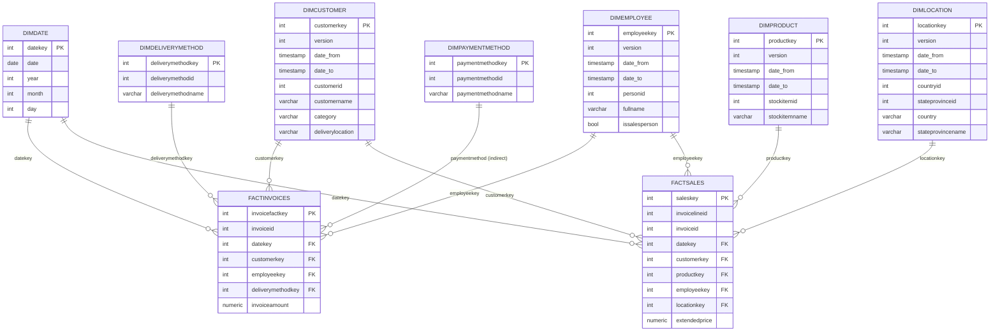

**Project Report — Data Mart (P01)**

**Authors:** Team / Student

**Date:** 2026-05-05

---

**Abstract**
- Objective: build a reproducible data mart (Medallion: Bronze → Silver → Gold) from the WWI sample OLTP, respecting VPN constraints (extract when VPN ON; apply when VPN OFF). This report documents architecture, data sources, profiling, dimensional model, ETL implementation, quality checks and delivery artifacts.

**1. Introduction & Objectives**
- Provide a documented, reproducible pipeline to extract source snapshots, transform into staging, and load a dimensional data mart using SCD Type 2 for slowly changing dimensions. Deliverables include: notebooks, scripts, profiling outputs, verification results and this report.

**2. Environment & Assumptions**
- Python venv using Python 3.12 (recommended). See `requirements.txt` for exact packages.
- Source DB reachable only via VPN (VPN ON required for `extract` phase). Supabase / DWH reachable when VPN OFF (apply phase).
- No changes to business data or source schema — snapshots in `tmp_snapshots/` are treated as canonical for offline development.

**3. Data Sources & Profiling**
- Main source objects: `customers`, `invoices`, `sales`, `stockitems`, `paymentmethods`, `customertransactions`, `locations`, `countries`, `stateprovinces`, `transactiontypes`, etc.
- Profiling artifacts: generated from saved snapshots in `tmp_snapshots/`. Table 1 (regenerated) is available at [scripts/data_profiling.md](scripts/data_profiling.md) and machine-readable metrics at [scripts/data_profiling.json](scripts/data_profiling.json).

- Key findings (summary):
  - `paymentmethodid` exists in `customertransactions` and `paymentmethods` mapping, but is not present in `invoices` (hence `DimPaymentMethod` is populated from transactions; invoices don't reference it). This is intentional and documented in the Gold design.
  - Bronze snapshots include small schema inconsistencies (example: `countries` snapshot has `ountryname` typo). Transformations in `02_silver.ipynb` address this mapping.
  - Table 1 now reports counts computed from `tmp_snapshots/` CSVs; for additional statistics (null%, distinct%) run the original `scripts/data_profiling.py` within a configured venv to produce the richer output.

**4. Dimensional Model (Design)**
- Design: Star schema with dimension tables implemented as SCD Type 2 where applicable and conformed date dimension.

See the detailed Data Warehouse Matrix: [data_warehouse_matrix.md](data_warehouse_matrix.md)

### ER Diagram (detailed)
The ER below is generated from the implemented DDL and ETL logic; it includes surrogate keys, current SCD columns and main FKs. Render with a Mermaid-capable viewer.



Notes: `DIMPAYMENTMETHOD` is populated from `paymentmethods` snapshot and referenced indirectly where payments are recorded in `customertransactions`. Check `03_gold.ipynb` for implementation details and the DDL in `scripts/create_indexes_and_constraints.sql`.

**5. ETL Implementation**
- Notebooks:
  - `00_setup.ipynb`: connection helpers, DDL for target schemas and `make_engine()` utility.
  - `01_bronze.ipynb`: two-phase pattern. `extract` (VPN ON) exports snapshots to `tmp_snapshots/`; `apply` (VPN OFF) ingests those CSVs into `bronze.*` using `register_load()` which writes load metadata into `bronze._load_control`.
  - `02_silver.ipynb`: staging transforms — cleans strings, fixes column typos (e.g., maps `ountryname` → `country`), and writes `silver.stg_*` tables.
  - `03_gold.ipynb`: loads dimensions (SCD Type 2 via `load_scd2()` and `row_hash()`), creates facts and keys, and applies indexes/constraints from `scripts/create_indexes_and_constraints.sql`.

- Key functions / patterns:
  - `make_engine()` — builds SQLAlchemy engine for either source (VPN) or DWH.
  - `compute_row_hash()` / `row_hash()` — canonicalize row values and compute hash for SCD change detection.
  - `load_scd2()` — merges staged rows into dimension with SCD2 semantics.
  - `register_load()` — logs metadata about each bronze apply (timestamp, row counts, source snapshot filename).

**6. Runbook (how to reproduce)**
1. Activate venv (Python 3.12) and install deps:

```powershell
source venv/Scripts/activate
pip install -r requirements.txt
```

2. Extract (VPN ON): run the extract cells in `01_bronze.ipynb` or use the snapshot script to export CSVs into `tmp_snapshots/`.

3. Apply (VPN OFF): run `01_bronze.ipynb` apply cells to load `bronze.*` from `tmp_snapshots/`.

4. Transform to Silver: open and run `02_silver.ipynb` (staging tables `silver.stg_*`).

5. Load Gold: run `03_gold.ipynb` to create dimensions and facts. Apply `scripts/create_indexes_and_constraints.sql` for performance.

6. Run checks: `python 04_quality_checks.py` and `python 99_verification.py` to generate `quality_report.json` and verification outputs.

**7. Quality & Verification**
- Quality checks are implemented in `04_quality_checks.py`. Verification summary and load metadata are produced by `99_verification.py` (see `quality_report.json`).
- Known issues and resolutions:
  - SQLAlchemy + Python 3.14 compatibility: project uses Python 3.12 venv to avoid import-time metaclass AssertionError. Pinning SQLAlchemy in `requirements.txt` recommended.
  - Bronze snapshots may have column name typos (example `ountryname`); mapping and explicit schema JSON snapshots are used to align columns.

**8. Deliverables Included**
- Notebooks: `00_setup.ipynb`, `01_bronze.ipynb`, `02_silver.ipynb`, `03_gold.ipynb`.
- Scripts: `scripts/data_profiling.py`, `scripts/create_indexes_and_constraints.sql`, `extract_docs.py`.
- Snapshots: `tmp_snapshots/` CSVs used for bronze apply.
- Outputs: `scripts/data_profiling.md`, `quality_report.json`, `report_draft.md` (draft artifacts).

**9. Appendices**
- Appendix A — Data profiling: see [scripts/data_profiling.md](scripts/data_profiling.md).
- Appendix B — Index/constraint DDL: [scripts/create_indexes_and_constraints.sql](scripts/create_indexes_and_constraints.sql).
- Appendix C — Verification results: [quality_report.json](quality_report.json).

---

