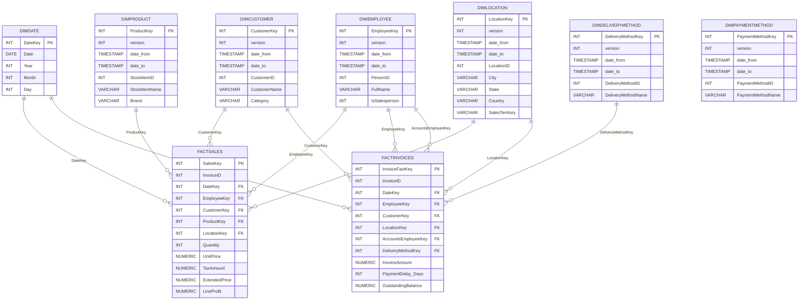

# Data Mart Implementation (P01) — Draft Report

## Team ###
First name (number), First name (number), First name (number)

---

## Introduction
Describe scope and objectives. (Fill this section.)

## Data sources
The operational source is the WWI sample database (Postgres on `postgres2.ipca.pt`). Below is the profiling summary (Table 1) produced by `scripts/data_profiling.py`.

<!-- Table 1 inserted from scripts/data_profiling.md -->

# Table 1 — Summary of WWI database contents

_Source database: `wwi` · generated: 2026-05-05T02:10:09.399465+00:00 UTC_

| Event / object | Table | Nr. records | Nr. columns | PK | PK uniqueness |
|---|---|---:|---:|---|---:|
| Buying groups | `buyinggroups` | 2 | 2 | `buyinggroupid` | 100.00% |
| Cities | `cities` | 37,940 | 5 | `cityid` | 100.00% |
| Colors | `colors` | 36 | 2 | `colorid` | 100.00% |
| Countries | `countries` | 190 | 8 | `countryid` | 100.00% |
| Customer categories | `customercategories` | 8 | 2 | `customercategoryid` | 100.00% |
| Customers | `customers` | 663 | 28 | `customerid` | 100.00% |
| Customer transactions | `customertransactions` | 97,147 | 12 | `customertransactionid` | 100.00% |
| Delivery methods | `deliverymethods` | 10 | 2 | `deliverymethodid` | 100.00% |
| Invoice lines | `invoicelines` | 228,265 | 11 | `invoicelineid` | 100.00% |
| Customer invoices | `invoices` | 70,510 | 23 | `invoiceid` | 100.00% |
| Order lines | `orderlines` | 231,412 | 9 | `orderlineid` | 100.00% |
| Customer orders | `orders` | 73,595 | 14 | `orderid` | 100.00% |
| Package types | `packagetypes` | 14 | 2 | `packagetypeid` | 100.00% |
| Payment methods | `paymentmethods` | 4 | 2 | `paymentmethodid` | 100.00% |
| Employees and contacts | `people` | 1,111 | 18 | `personid` | 100.00% |
| Special deals | `specialdeals` | 2 | 12 | `specialdealid` | 100.00% |
| State provinces | `stateprovinces` | 53 | 6 | `stateprovinceid` | 100.00% |
| Stock groups | `stockgroups` | 10 | 2 | `stockgroupid` | 100.00% |
| Products / stock items | `stockitems` | 227 | 22 | `stockitemid` | 100.00% |
| Transaction types | `transactiontypes` | 13 | 2 | `transactiontypeid` | 100.00% |

## Dimensional modelling
(Write objectives and questions; include Data Warehouse Matrix.)

## Design of the dimensional data model
(Add ER diagram and data description maps; include Appendix A.)

### ER Diagram
The ER diagram below describes the star schema (dimensions and fact tables). Rendered from the DW DDL; the Mermaid source is included so you can render it locally (e.g., with Mermaid Live Editor).

## Data mart implementation
Describe ELT process, medallion architecture, notebooks used (`00_setup.ipynb`, `01_bronze.ipynb`, `02_silver.ipynb`, `03_gold.ipynb`) and include `scripts/dw_script.sql` as Appendix B.

## Results
Include counts per table (use `99_verification.py` output), `quality_report.json` excerpts, and observations.

## Conclusion
Critical review and future work.

## Bibliography
(APA format)

## Appendix A — Data description maps
(Include `scripts/data_description_maps.md` or rendered tables.)

## Appendix B — SQL DW Script
(Include `scripts/dw_script.sql`.)
